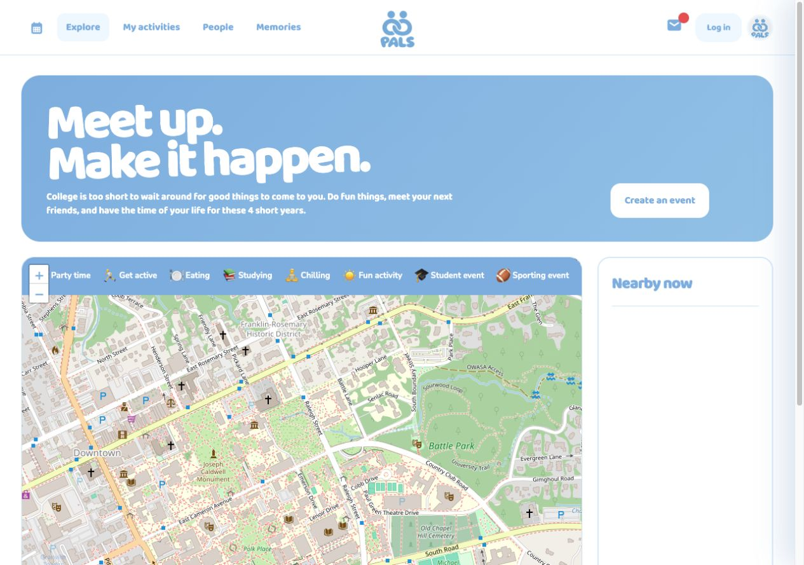
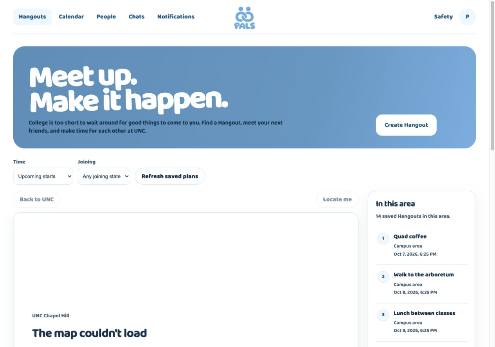
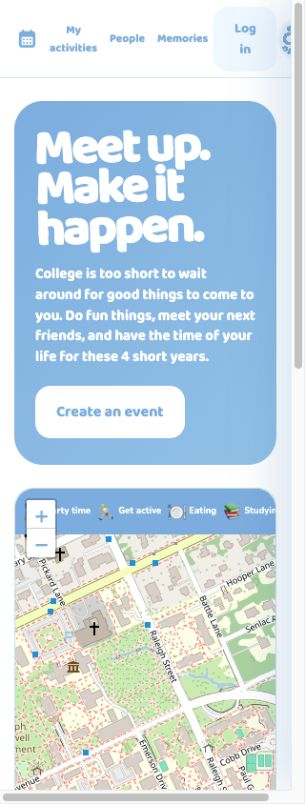
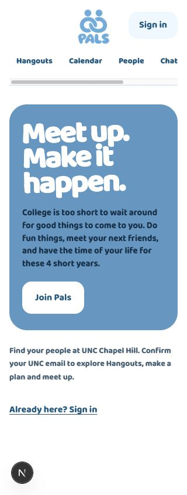
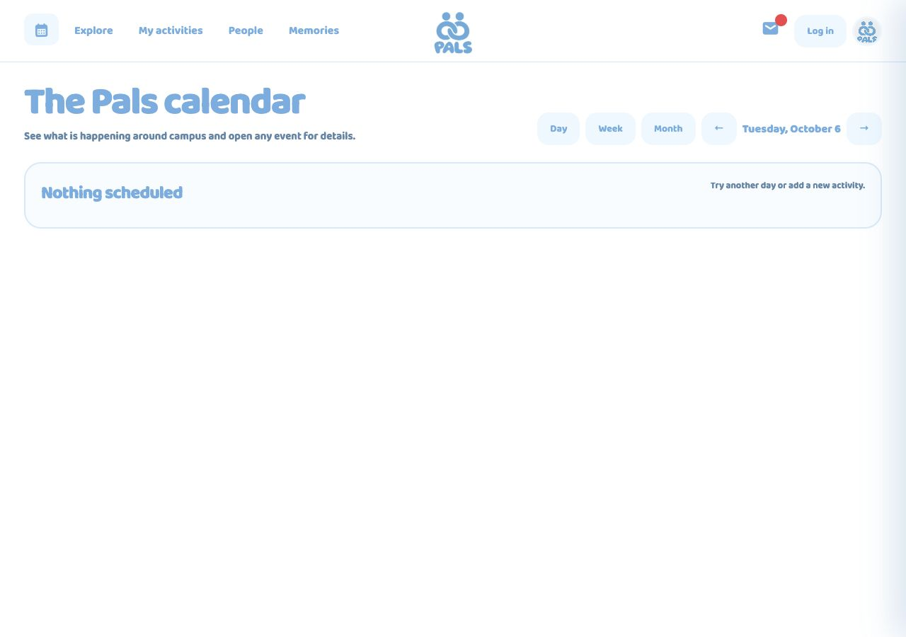
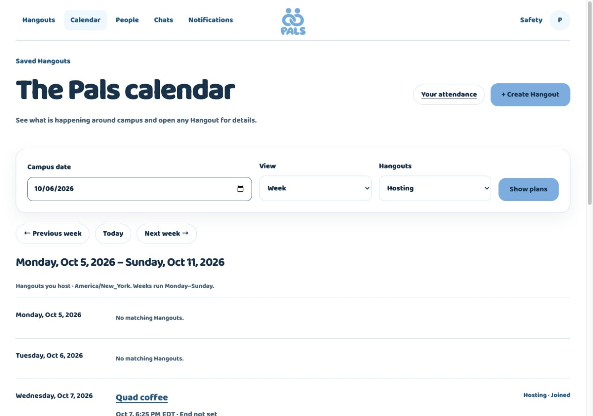
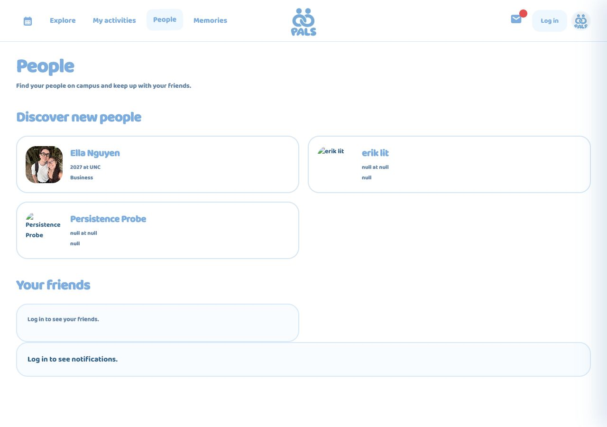
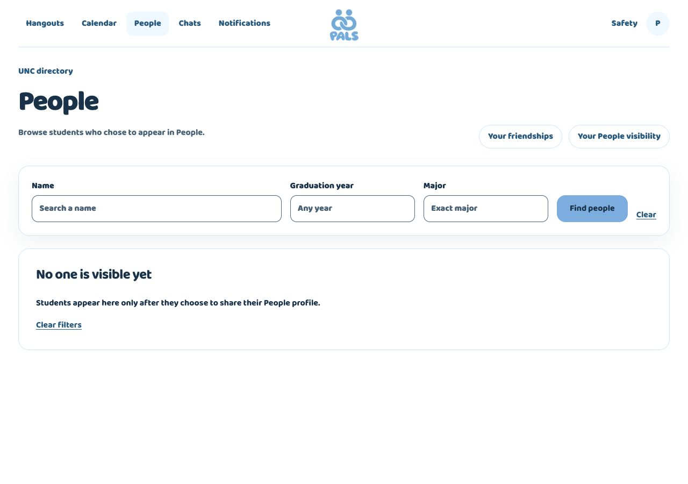

# TASK-028 reference comparison and interaction plan

Reading this as a faithful refinement of a campus coordination app for UNC students, using the model's own rounded Pals language and existing native CSS. Leon's Taste applies contextually; reference fidelity and accepted product/privacy/accessibility rules control. Design variance 3, motion 2, density 4, derived from the observed orderly map/list layout and restrained transitions.

## Captured baseline, 2026-10-06

Browser resolves https://usepals.com/ to https://www.usepals.com/. Desktop viewport 1280×900: header 88, centered logo 90×70; main32px top/34px side padding; hero 30px radius,33px/40px padding, roughly 265px high; headline Baloo2/800,80.64px/.8 line-height; blue #79afe0; map/list 24px gap, map 20px radius, narrow Nearby rail. Controls Baloo2/700, body uses the live inherited Baloo2 (earlier model CSS has Nunito Sans). Existing logo SHA256 exactly matches public model a237c3c5c10256b5b48c0ba226400ac193b31d2112598e6d51400e234fec6bd1. Self-host exact Baloo2/700/800 and NunitoSans/700/800 with OFL licenses; retain existing Nunito fallback.

Captured Explore and Calendar desktop, Explore and logged-out create/auth prompt at 390×844. The mobile model squeezes header controls, hides Explore and wraps Log in; implement accessible two-row navigation instead. Public model Calendar/People/first-create prompt are inspectable, but no authenticated reference session is available. Do not claim parity for unseen profile/editor/chat states or import sample peer photos/data. Capture artifacts remain local under `/private/tmp/pals-task028-evidence/reference`.

## Implementation plan and necessary differences

- Center existing exact logo; combine desktop student header/navigation while keeping Hangouts · Calendar · People · Chats · Notifications, source-gated destinations and avatar settings. Accessible wrap/scroll on narrow screens,44px targets, skip/focus states and reduced motion.
- Match feature hero typography, compact height, rounding, spacing and white primary action. Preserve readable semantic action/body foregrounds: model pale blue/white small text does not meet contrast. Use darker accessible foregrounds and sufficient contrast behind large white headings; document measured values at final comparison.
- Saved discovery uses real Mapbox and source-authorized approximate location, with empty/error/loading recovery and list alternative. No public fake map/activity. Reference Leaflet tiles, category inventory, terminology and public peer photos do not change accepted scope.
- Improve profile/upload, browsing-return context and chat refresh/scroll/recovery in assigned independent slices. Retain drafts only in mounted owner-authorized memory; clear on auth/permission loss. No new schema, permissions, provider, peer projection or Realtime.
- Compare corresponding desktop/mobile public and authorized student surfaces; verify320/390/820/1280 and keyboard interactions. Screens unavailable due to credentials remain explicitly unverified. Tests and builds supplement rendered evidence.

## First rendered correction

At1280 the app now measures header 88px, hero 265px at x34/y120, headline 80.64px/64.512px and logo 90×70, matching the reference's corresponding type/geometry before its -1.5° heading rotation. The rotation is now matched too. The body/action/nav foreground stays dark for contrast. Feature blue is darker behind white large headings (#5c8fb9→#6498c3, white contrast 3.45→3.08), then transitions toward exact brand #79afe0 on desktop; phone uses #6498c3 (white 3.08). Small body text uses dark ink. These are deliberate accessibility differences from model white small text on #79afe0 (2.33). Public entry uses Join Pals and explains UNC confirmation; the real map remains authenticated to preserve accepted access.

Review corrected return-camera loss, early scroll restoration and missing return focus. Camera is validated/coarsened to a campus area, expires after 30min and lives in tab memory only. Locate-me orientation clears/excludes camera memory. Stored filter/scroll return preferences are consumed once; no Hangout IDs/records, peer data or message/profile drafts enter browser storage. Final permission/data queries remain fresh.

## Corresponding rendered comparisons

Captured on 2026-10-06. Left is the public model; right is the local app (public phone entry and caller-authorized desktop surfaces with disposable fixtures). Dimensions were checked from the rendered page; stale captures from an inactive tab were replaced. The app's map fallback is genuine: no local Mapbox token is configured. This does not certify rendered tiles, pins or camera restoration. The public model has no visible Hangouts in the captured rail; the final app capture shows 14 disposable plans created through authorized caller RPCs. A separate earlier real-form creation was also confirmed. Screenshots are evidence, not shipped sample data.

| Surface | Model | App |
| --- | --- | --- |
| Discovery, 1280×900 |  |  |
| Public entry, 320×844 |  |  |
| Calendar, 1280×900 |  |  |
| People, 1280×900 |  |  |

The model's month grid and category toolbar are not accepted app features: retain Day/Week and the authoritative saved-plan filters. People uses accepted opt-in text discovery and its genuine empty state; no public model peer photos or records are copied into the app. The reference screenshot documents publicly visible model cards only; it does not supply app data. Calendar, profile, chat and form surfaces inherit the exact display font, ink, brand, rounding and controls rather than inventing unseen reference screens. Remaining visual differences include the accessible darker hero/foregrounds, accepted navigation, private authenticated map (Join Pals on public entry), Mapbox styling, Day/Week layout, text-only People and genuine permission-dependent content. The model's 320px header clips its logo and overflows; the app preserves all destinations in a second scrollable row, which moves the hero down. A separate [320px restored-scroll fallback capture](evidence/TASK-028/app-saved-320.jpg) records the authenticated return state, not a page-top parity comparison.

## Current browser evidence

Confirmed-UNC account entered Hangouts before adding profile details or a photo. Optional profile edit saved with confirmed feedback; selected photo preview appeared before upload, private upload succeeded, and the corrected header loaded owner photo revision 2 then revision 3 after replacement. Account menu Escape restored summary focus, and Safety remained available through its mobile menu. Hangout creation saved approximate Polk Place coordinates, preview/detail navigation worked, return retained both filters and focused the rail heading, group chat confirmed its message and reset the composer, and weekly Hosting Calendar showed that same saved plan. People correctly remained empty because nobody had opted in.

Public home/sign-in/sign-up and authenticated discovery were inspected at 320/390/820/1280; profile and chat at 390. Document width remained within the viewport. Direct automation fill on the native date input did not commit React state; native ArrowUp/ArrowDown input did, and the real form then saved. Do not report the unsuccessful automation fills as a source defect or a successful creation. The final 14-plan list returned from saved details with both filters retained, nonzero page scroll (y=486) and focus on “In this area” after fresh loading; [return capture](evidence/TASK-028/app-long-list-return-1280.jpg). Final Calendar/People captures were replaced after the heading corrections, and weekly Hosting showed the same fixture plans. Live map camera/pins, authenticated model profile/chat and hosted student/operator recovery flows remain unverified browser states.
